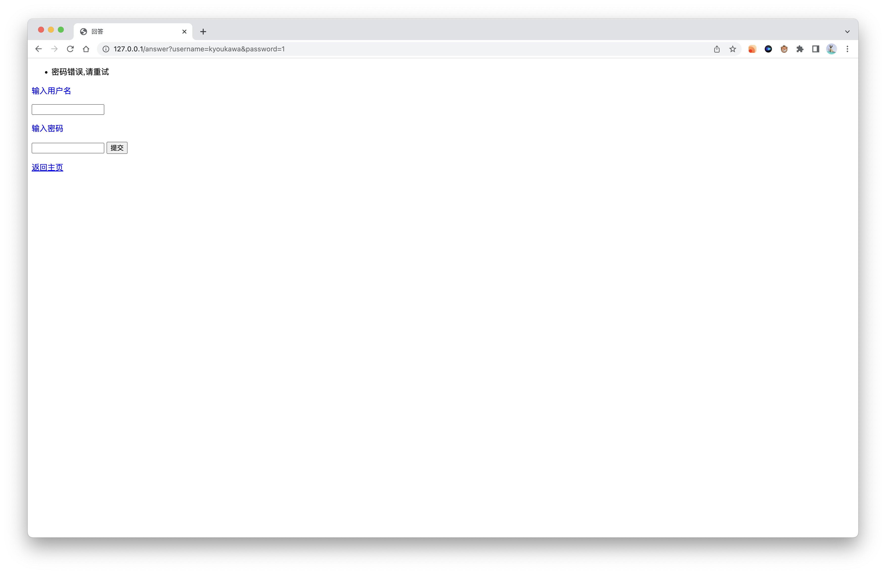

# fake-tapechat
一个在朋友圈吹牛的产物(

~~但是这却是我第一个正经的开源项目~~

ps:本项目采用MIT协议开源.

# 0.0.1
基于Python的flask模块

## 配置
```shell
pip install flask
```

## 运行
```shell
python3 main.py
```

ps:感谢cyh提供的代码

# 0.0.3
~~0.0.2没啥更新就不写了~~
## new features
### Dark mode
css中添加这段代码，可以让网页在深色模式下背景改为黑色
```css
@media (prefers-color-scheme: dark) {
  body {
    background: #222;
    color: #eee;
  }
}
```
by:kyoukawa(jc)
### error.html
当密码错误，或重复注册（或有人试图盗号 时跳转至此网页
by:ChenYuHe
### 返回首页&&首页导航
```html
<!-- 返回首页 -->
<a href = "/"> 返回首页 </a>

<!-- 跳转，例如signup -->
<a href = "/signup"> 注册 </a>
```
by: kyoukawa(jc) && ChengYuHe

### 背景图片
~~已经被姜川删除(~~
by:ChengYuHe

# 0.0.4
## flask flash
在html页面闪现提示(所以error.html没用了

效果:


python部分:
```python
from flask import Flask, flash, redirect, render_template, request, url_for
# 一定要加这几个模块不然会报错(别问我怎么知道的
app.secret_key = 'random string' # 随便设置一个秘钥,在 app = Flask(__name__) 的后面写
# 调用
flash("Hello world!!!")
```

html部分:

在body中添加此段代码
```html

		
			<ul class=flashes>
				
					<li>{{ message }}</li>
				
			</ul>
        

```

## admin mode
/admin

密码:12345678

**注意输入密码后,用户数据将会清空**

# 0.0.5

~~一转眼都快寒假了,一个学期没更新了~~

## /admin

更改为查看所有用户的账号密码

## /clear

与原来admin功能相同

## bug fix

1. 注册界面莫名提示成功
2. 一系列和json的空处理相关的bug

# 1.0.0

新增回答功能

# 1.1.0

支持自定义一个admin账户

下一步搞多个账户:)
